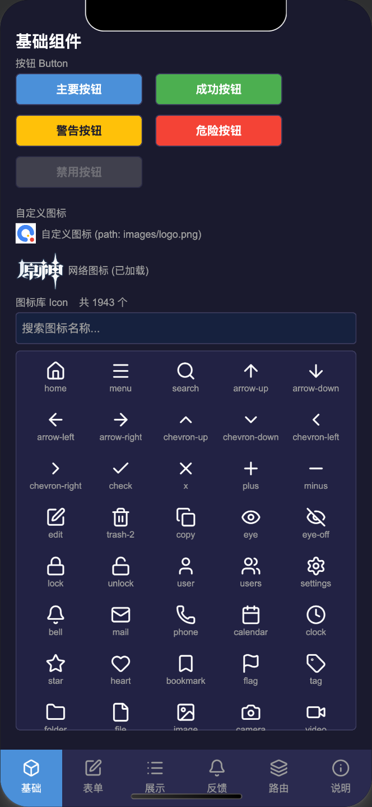
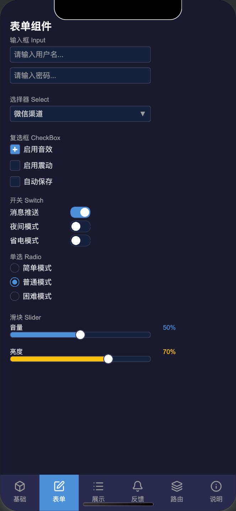
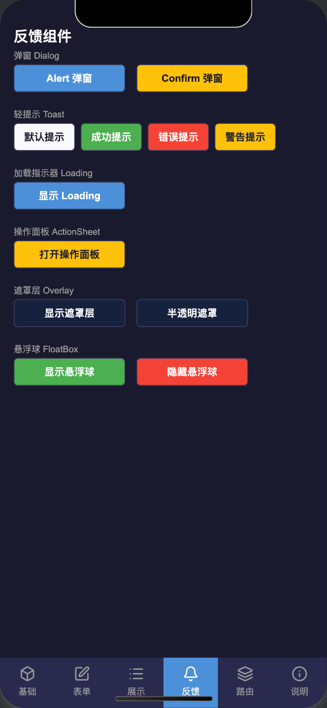

# Minigame UI Kit

基于 PixiJS 的微信小游戏 UI 组件库，提供一套完整的 UI 组件，适用于任何支持 WebGL 渲染的小游戏环境（包括微信、抖音 等小游戏平台，以及普通浏览器端的 H5 游戏）。包含 Button、Input、Dialog、Toast、Router 等二十余个常用组件，开箱即用，无需额外构建配置，适合快速搭建 Demo 或 MVP 原型

## 预览

<p>
  
  
  
</p>

## 背景

在开发小游戏 SDK 以对接各渠道的过程中，需要为每个渠道提供可运行的 Demo，用来验证登录、支付、分享、广告等接口是否正常工作。为了降低维护成本，期望各渠道 Demo 在架构上尽量统一、基础 UI 能力保持一致，把精力聚焦在渠道差异上，而不是每个平台都重新搭一遍界面

这类渠道验证 Demo 生命周期短、迭代频繁，对 UI 美观度的要求通常不高，但必须能在真实的小游戏环境中稳定跑通。现有方案要么依赖手搓 Canvas（麻烦），要么需要引入完整的游戏引擎（过重），一个可接受的方案是使用轻量级的 2D 渲染引擎来处理绘制和交互

这个库的出发点就是利用各家小游戏平台原生的 WebGL 渲染能力，以 PixiJS 为底层，封装一套足够用的 UI 组件。让开发者可以快速拼出 Demo 界面，把精力集中在渠道能力的验证上，而不是反复造轮子

## 运行

用微信开发者工具打开项目根目录，点击预览或真机调试即可。无需额外构建步骤

设计稿基准尺寸为 1080×1920，组件尺寸常量定义在 `js/ui/common/styles.js`

## 组件列表

基础：Button、Icon、Input、CheckBox、Radio、Switch、Slider、ProgressBar

容器：Page、ScrollBox、Swiper、Collapse

浮层：Dialog、Toast、ActionSheet、Select、Overlay、FloatBox

导航：TabBar、Router

列表：ListItem

所有组件从 `js/ui/index.js` 统一导出

## 二次开发指导

### 新增页面

在 `js/pages/index.js` 的数组中追加一项：

```js
{ label: '我的页面', icon: 'star', Page: MyPage }
```

`icon` 字段对应图标库中的名称（可在"基础"Tab 的图标库中搜索）。`Page` 类继承自 `Page` 组件，构造函数接收 `(w, h)`

### 新建页面类

```js
import { Page, Button, Toast } from '../ui/index';
import { COLOR, SIZE } from '../ui/common/styles';

export default class MyPage extends Page {
    constructor(w, h) {
        super(w, h);
        this._build();
    }

    _build() {
        let y = SIZE.pad;

        const btn = new Button({
            text: '点击',
            width: SIZE.btnW,
            height: SIZE.btnH,
            color: COLOR.primary,
            onTap: () => Toast.show({ text: '操作成功', type: 'success' }),
        });
        btn.x = SIZE.pad;
        btn.y = y;
        this.addChild(btn);
    }
}
```

`Page` 基类会自动处理内容超出时的惯性滚动，直接 `this.addChild()` 即可，无需手动管理滚动

### 通知类组件

通知类组件（Dialog、Toast、ActionSheet）通过全局 `stage` 层级系统渲染，不需要手动挂载到任何容器

```js
import { Toast, Dialog } from '../ui/index';

// Toast
Toast.show({ text: '提示文字' });
Toast.show({ text: '操作成功', type: 'success', duration: 3000 });
Toast.show({ text: '操作失败', type: 'error' });

// Dialog
await Dialog.alert({ title: '提示', content: '操作已完成' });

const confirmed = await Dialog.confirm({ title: '确认', content: '是否继续？' })
    .then(() => true)
    .catch(() => false);
```

### 路由组件

Router 组件适合在单个 Tab 页内实现多级导航：

```js
import { Router, Page } from '../ui/index';

export default class MyPage extends Page {
    constructor(w, h) {
        super(w, h);

        const router = new Router({
            width: w,
            height: h,
            transition: 'slide', // 'slide' | 'fade' | 'none'
            routes: [
                { path: '/', builder: (_, router) => buildHome(w, h, router) },
                { path: '/detail/:id', builder: (params, router) => buildDetail(w, h, router, params) },
            ],
        });
        this.addChild(router);
    }
}
```

路由视图是普通的 `PIXI.Container`，可选实现 `onEnter(params)` 和 `onLeave()` 生命周期方法

### 使用 Input

Input 组件依赖键盘适配器。项目已在 `js/main.js` 中注册了微信小游戏键盘适配器，直接使用即可：

```js
import { Input } from '../ui/index';

const input = new Input({
    width: SIZE.inputW,
    height: SIZE.inputH,
    placeholder: '请输入...',
    onInput: (value) => console.log(value),
    onChange: (value) => console.log('最终值:', value),
});
```

如需在其他平台使用，可以参考微信的实现并注册自定义适配器：

```js
Input.setDefaultAdapter({
    /**
     * 在此处实现拉起键盘逻辑
     * @param {string} currentValue - 当前输入框的值
     * @param {object} options
     * @param {'text'|'number'|'password'} options.type - 键盘类型
     * @param {number} options.maxLength - 最大输入长度，0 表示不限制
     * @param {(value: string) => void} options.onInput - 在每次触发输入时调用 options.onInput(value) 更新输入框的值
     * @param {() => void} options.onClose - 在键盘关闭时调用 options.onClose() 进行清理
     * @returns {Promise<void>} 在键盘关闭后 resolve，以便 Input 组件知道何时结束输入状态
     */
    open(currentValue, options) {},
    /**
     * 在此处实现关闭键盘逻辑 如 wx.hideKeyboard()
     * @returns {void}
     */
    close() {},
});
```

### 样式常量

所有颜色和尺寸常量集中在 `js/ui/common/styles.js`，修改主题色只需调整 `COLOR` 对象中的对应值

### 图标

图标库基于 Lucide 图标集，图标名称可在"基础"Tab 的图标库中搜索。使用方式：

```js
import { Icon } from '../ui/index';

// 图标库图标
const icon = new Icon({ name: 'star', size: 48, color: COLOR.primary });

// 本地图片
const icon2 = new Icon({ path: 'images/logo.png', size: 64 });
```

### 层级系统

内置了一个简单的层级系统，分为三个层级：LAYER_0、LAYER_1、LAYER_2，这三个层级都在基础的画布之上，但各自有额外的优先级，数字越大的在上面，按以下定义进行约定：
| 层级 | 用途 |
| --- | --- |
| LAYER_0 | Select 组件的下拉框等需要显示在普通画布上方的附加类内容 |
| LAYER_1 | Dialog、ActionSheet、Overlay 等弹窗和蒙版内容 |
| LAYER_2 | Loading、Toast 等需要置顶的内容 |

需要自定义浮层时，使用 `stage.addTo()` 挂载到对应层级：

```js
import { stage, LAYER } from '../ui/index';

stage.addTo(LAYER.LAYER_0, myOverlay);
stage.removeFrom(LAYER.LAYER_0, myOverlay);
```
